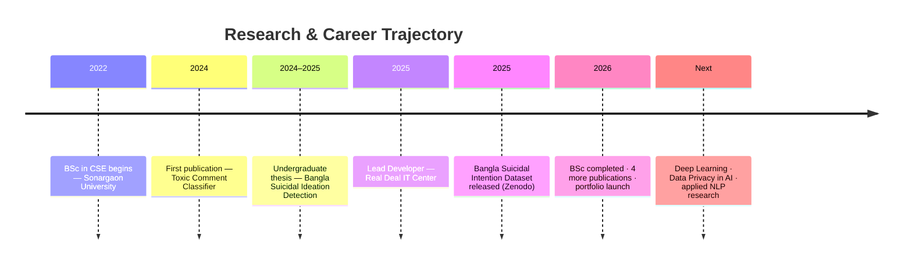

<div align="center">


<a href="https://jahangirhussen.github.io/jahangir-hussen-portfolio/">
  
</a>
<a href="mailto:jahangirhussen.programmer@gmail.com">
  
</a>
<a href="https://www.linkedin.com/in/jahangir-hussen-9204b8234">
  
</a>
<a href="https://orcid.org/0009-0007-1024-6644">
  
</a>

<br/><br/>


&nbsp;

&nbsp;

&nbsp;

&nbsp;


<br/>
<sub>🔄 Publication, Codeforces, LeetCode & GitHub stats below auto-refresh daily via <a href="https://github.com/Jahangirhussen/Jahangirhussen/actions/workflows/update-stats.yml">GitHub Actions</a> — no hardcoded numbers.</sub>

</div>

<div align="center">

<a href="#-about-me">About</a> ·
<a href="#️-tech-stack">Tech Stack</a> ·
<a href="#-github-analytics">Analytics</a> ·
<a href="#-professional-experience">Experience</a> ·
<a href="#-featured-research">Research</a> ·
<a href="#-competitive-programming">Competitive</a> ·
<a href="#-roadmap">Roadmap</a> ·
<a href="#-connect-with-me">Connect</a>

</div>

<br/>

## 👨‍💻 About Me

```yaml
name:        Jahangir Hussen
role:        Lead Developer @ Real Deal IT Center
education:   BSc in CSE, Sonargaon University (CGPA 3.76/4.00)
focus:       Software/Web/App/CMS/SaaS Development · ML · DL · QML · XAI
publications: see live ORCID Works badge below
based_in:    Dhaka, Bangladesh
currently:   Delivering production web solutions + researching Bangla NLP
```

- 🚀 Software Development · Web Apps · Mobile-ready App Interfaces · CMS (WordPress/WooCommerce/Shopify) · SaaS builds for international clients
- 🧠 Machine Learning · Deep Learning · Quantum Machine Learning (QML) · Explainable AI (XAI) · NLP research
- 📚 Publications, citations & competitive-programming ratings below are live — pulled directly from ORCID, Codeforces & LeetCode
- 🌐 Full portfolio & CV → **[jahangirhussen.github.io/jahangir-hussen-portfolio](https://jahangirhussen.github.io/jahangir-hussen-portfolio/)**

<br/>

## 🛠️ Tech Stack

<div align="center">


<br/><br/>


</div>

<br/>

<details>
<summary><b>🧩 Expand: Full skill breakdown</b></summary>
<br/>

| Category | Skills |
|---|---|
| **Languages** | C, C++, Java, Python, JavaScript, HTML, CSS, C#, R |
| **Software Development** | OOP, System Design, REST APIs, Git-based Workflows |
| **Web Development** | React.js, HTML5, CSS3, Responsive Design |
| **App Development** | Mobile-responsive Web Apps, Cross-platform UI |
| **CMS / SaaS / E-Commerce** | WordPress, WooCommerce, Shopify (Liquid), PHP, SaaS product delivery |
| **Machine Learning** | scikit-learn, Random Forest, Pandas, NumPy |
| **Deep Learning** | TensorFlow, Keras, LSTM, BERT variants |
| **Quantum Machine Learning (QML)** | Exploring quantum-enhanced ML algorithms |
| **Explainable AI (XAI)** | LIME, model interpretability for high-stakes predictions |
| **Databases & Tools** | MySQL, MongoDB, Git, VS Code, Jupyter Notebook |
| **Other** | Pygame, LaTeX, Embedded Systems / Hardware Interfacing |

</details>

<br/>

## 📊 GitHub Analytics

<div align="center">

</div>

<div align="center">

</div>

<div align="center">


</div>

<sub align="center">↑ self-rendered from live GitHub/LeetCode API data via GitHub Actions — the old vercel stat-card mirror kept going down, so this replaces it.</sub>

<br/>

## 🐍 Contribution Snake

<div align="center">

</div>

<br/>

## 💼 Professional Experience

### 🔥 HeatCoreX
**Online Operations Manager** · UK Heating & Plumbing Services
<br/>`Part-time · Remote · Since 2024`

- Lead and coordinate online operations and digital team workflows
- Oversee SEO, social media, content, and graphic design activities
- Coordinate daily tasks, priorities, and team execution
- Manage website operations, maintenance, and issue resolution
- Monitor and maintain the company's overall digital presence

📧 [jahangirhussen@heatcorex.co.uk](mailto:jahangirhussen@heatcorex.co.uk) · 🌐 [heatcorex.co.uk](https://heatcorex.co.uk)

<br/>

### 💻 Real Deal IT Center
**Lead Developer** · IT & Digital Services
<br/>`On-site · Since December 2024`

- Lead web development and technical projects
- Build and maintain WordPress, Shopify, and e-commerce solutions
- Handle website development, optimization, and technical maintenance
- Coordinate development workflows and project delivery
- Implement and maintain modern web-based solutions

📧 [jahangirhussen@realdealitcenter.com](mailto:jahangirhussen@realdealitcenter.com) · 🌐 [realdealitcenter.com](https://realdealitcenter.com)

<br/>

## 🔬 Featured Research

<div align="center">


<sub>↑ live count from ORCID's public API — updates automatically when a new work is registered</sub>

<br/><br/>

[](https://orcid.org/0009-0007-1024-6644)
[](https://scholar.google.com/citations?user=mdCnjKcAAAAJ&hl=en)
[](https://www.scopus.com/authid/detail.uri?authorId=60309516800)
[](https://www.researchgate.net/profile/Jahangir-Hussen)

<sub>Google Scholar, Scopus & ResearchGate have no free public API — badges above link to the live profile page itself rather than an embedded number, so citation/h-index figures are never hardcoded or faked here.</sub>

<br/><br/>

| Publication | Venue | Year |
|---|---|---|
| [Bangla Suicidal Ideation Detection: Performance & Efficiency Benchmark](https://doi.org/10.65136/jati.v10i1.11) | J. Applied Technology & Innovation | 2026 |
| [Explainable AI-Driven Bangla News Classification](https://doi.org/10.65136/jati.v10i1.325) | J. Applied Technology & Innovation | 2026 |
| [Green AI for Sustainable Development in Circular Economies](https://doi.org/10.4018/979-8-3373-7694-3.ch003) | Book Chapter — IGI Global | 2025 |
| [Predicting Heart Disease with Machine Learning](https://su.edu.bd/web_assets/journal/journal_five/journal77.pdf) | Sonargaon University Journal | 2025 |
| [Defending Digital Discourse: Toxic Comment Classifier](https://doi.org/10.14445/23488387/ijcse-v11i10p104) | Intl. J. Computer Science & Engineering | 2024 |
| [Bangla Suicidal Intention Dataset (13,288 samples)](https://zenodo.org/doi/10.5281/zenodo.17528394) | Zenodo Dataset | 2025 |

</div>

<div align="center">

[](https://doi.org/10.65136/jati.v10i1.11)
[](https://doi.org/10.4018/979-8-3373-7694-3.ch003)
[](https://zenodo.org/doi/10.5281/zenodo.17528394)

</div>

<br/>

## 🗺️ Roadmap



<br/>

## 🏅 Competitive Programming

<div align="center">

<a href="https://leetcode.com/u/jahangirhussen/"></a>
<a href="https://leetcode.com/u/jahangirhussen/"></a>
<a href="https://codeforces.com/profile/jahangirhussen5011"></a>
<a href="https://codeforces.com/profile/jahangirhussen5011"></a>
[](https://www.codechef.com/users/jahangirhussen)
[](https://www.kaggle.com/jahangirhussen)

<br/><br/>


</div>

<br/>

## 📫 Connect With Me

<div align="center">

<a href="https://www.linkedin.com/in/jahangir-hussen-9204b8234" target="_blank"></a>
<a href="mailto:jahangirhussen.programmer@gmail.com" target="_blank"></a>
<a href="https://github.com/jahangirhussen" target="_blank"></a>
<a href="https://www.kaggle.com/jahangirhussen" target="_blank"></a>
<a href="https://orcid.org/0009-0007-1024-6644" target="_blank"></a>

</div>

<br/>

<details>
<summary><b>💡 Currently working on</b></summary>
<br/>

- 🔭 Extending Bangla NLP research into transformer-based explainability (XAI)
- 🌱 Deepening WordPress/Shopify freelance delivery pipeline at Real Deal IT Center
- 📊 Exploring data-privacy-preserving techniques for low-resource-language ML

</details>

<br/>

<div align="center">
<sub>Built with ☕ and a lot of <code>git push</code> — thanks for stopping by!</sub>
</div>


